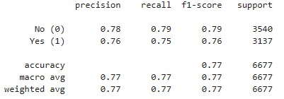

#  Seasonal Flu Vaccination
*Prepared By Kit N., Lucas F. and Navpreet N.*   *12 January 2022*

## Introduction

This exercise aims to predict whether individuals will receive their seasonal flu vaccine. To create the predictive model, we fit a machine learning model with random forest classifier (the baseline) to the vaccination data collected in the United States National 2009 H1N1 Flu Survey (NFHS)[^1]. 

Once the baseline is established, we explore various tuning techniques includes:
* feature selection to reduce the number of input features,
* hyperparameters tuning with RandomisedSearchCV, and
* hyperparametrs tuning with GridSearchCV.

A second machine learning model involving deep learning is considered. 

We then compare the performance of each model to determine which has sufficient predictive power. *To add - discuss performance metric and what will indicate stronger performance*

[^1]: The NFHS was one-time survey designed to monitor vaccination during 2009-2010 flu season in response to the 2009 H1N1 pandemic. For further information, refer to [U.S. National 2009 H1N1 Flu Survey (NFHS)](https://webarchive.loc.gov/all/20140511031000/http://www.cdc.gov/nchs/nis/about_nis.htm#h1n1)

## The Dataset
 The NFHS data contains 26,707 survey respondents collected between late 2009 and early 2010. Each survey respondents were asked whether they had received H1N1 and seasonal flu vaccines and additional questions about themselves such as social, economic and demographic background, opinions on risks of illness and vaccine effectiveness, and behaviours towards mitigating tranmission. 

 This dataset is a copy shared by the United States National Center for Health Statistics for a data science practice competition hosted by [DrivenData](https://www.drivendata.org/competitions/66/flu-shot-learning/).

 Given the focus of this exercise is on seasonal flu vaccination prediction, H1N1 specific data included in the NFHS data is dropped and not used for fitting machine learning model. After removing H1N1 specific variables, the starting point is a dataset with 30 columns. The first column "respondent_id" is a unique identifier. The remaining columns include answer to additional questions asked in the survey. [Appendix 1](#appendix-1) describes the features in detail.  
 
### Data checking and cleaning
The following summarises the data checking and cleaning performed:
* **Class balance** - We check if there is any imbalanced class issue in the dataset.  
  
"seasonal_vaccine" target variable has balanced class.

* **Data quality** - We check if there is any missing or null value, using the ".isnull.sum()" and "info" method. Out of the 30 columns:   - 6 columns (including the target variable column) has no missing value;   - 3 feature columns have more than 40% missing values; and   - the remaining feature columns have low volume of missing values where the missing value percentages range between 0.1% and  17.0%. 

**Strategy for handling missing values**
* 3 features columns with more than 40% missing values are excluded from the modelling. These features are "health_insurance", "employment_industry" and "employment_occupation".
* For the remaining features columns, missing values are replaced with the "most_frequent" value observed using sklearn.impute.SimpleImputer module. The most_frequent values are selected as it works well for both numerical and categorical variables.

### Exploring the data
We study the vaccination pattern by plotting every single feature against the target variable. If a feature is correlated with the target, we expect to see different vaccination pattern as the values of the feature vary. Below are samples of the plot used to study the vaccination pattern.

From the sample plots above, opinion questions seem to have high correlation with the target, but not sex.

## Build and Train Machine Learning Model
### Establish the baseline model
Random forest machine learning model has been chosen as the baseline model. The key considerations are:
* Random forest model is known for its high accuracy and ability to handle large and complex datasets. This is important as the NFHS data has a high number of features. 
* Random forest model is robust to overfitting. This means it is less likely to produce poor generalisation performance when applied to new data. This is an important consideration in this exercise as we would like a model that is able to generalise well to new examples and not just perform well on training data.
* Random forest model is relatively simple to implement and does not necessarily require much fine-tuning.

We fit the baseline model to the full set of features available in the cleaned NFHS data. 
  
The baseline model has an accuracy score of 76.13%.

### Tune the baseline
In this section, we explore both tuning parameters and tuning hyperparameters.

#### i. Features Selection
Features selection involes reducing the number of input features used to train the model. To select which features to include, a correlation matrix is computed to identify the features that are most correlated to the target variable. Four features with the highest absolute correlation value are used to define a new set of features, reducing the number of input features from 54 to 4. The new set of features are ["age_group_65+ years","doctor_recc_seasonal", "opinion_seas_risk", "opinion_seas_vacc_effective"]. 

  

The accuracy score of the model with new set of features was 75.15%, slightly lower than the baseline. This suggests the selected four features covered most of the explanatory percentage. Additional features may be correlated with the selected four features, or irrelevant to the target variable and hence only add marginally to the explanatory power.

#### ii. Hyperparameters tuning with RandomizedSearchCV
RandomizedSearchCV is a library from SKLearn that allows a user to perform hyperparameter tuning on a given model by specifying a list of hyperparameter to tune and a list of possible values for each. It randomly selects a combination of hyperparameters from these lists and fits the model using them. The fitted model is then scored using cross-validation, and the process is repeated a number of times as defined by the user. The model that results in the highest mean score across the cross-validation folds is selected as the best model, and the best combination of hyperparameters is retained. 

We explored tuning the following hyperparameters:
* n_estimators (refers to the number of tress in the forest);
* max_features (refers to the maximum number of features the model considers when looking for the best split at each tree node);
* min_samples_split (refers to the minimum number of samples required at a node in order for the node to be split)

We set up the search to train 20 models over 2 folds of cross-validation (resulting in fitting 40 models in total), scoring the best fit based on accuracy. 

  

The best fit model resulted in 77.18% accuracy score. The required hyperparameters are:
* n_estimators = 207,
* max_features = 10;
* min_samples_split = 23.  

This is an improvement on the baseline model.

#### iii. Hyperparameters tuning with GridSearchCV
GridSearchCV is another library from SKLearn that allows a user to perform hyperparameter tuning. It differs from RandomizedSearchCV in that it comprehensively searches over a specified hyperparameter grid, rather than randomly selecting a number from the specified ranges of hyperparamters given. One advantage of GridSearchCV is that it is guaranteed to find an optimal combination of hyperparameters, since it examines all possible combinations. However, it can be resource intensive since it examines every combination of hyperparameters.

Implementing tuning with GridSearchCV, we have used the following hyperparameters:
* n_estimators = 200, 500;
* max_features = 10, 15, 20;
* min_sample_split = 20, 25, 30.

The algorithm looks at the model with highest mean score across the cross-validation folds and selects it as the best model, and the combination of hyperparameters is retained. 

  

The GridSearchCV best model achieved 77.19% accuracy. The required hyperparameters are:
* n_estimators = 500,
* max_features = 15,
* min_samples_split = 30.  

This is an improvement on the baseline model.

### An alternate: Deep Learning Model

### Comparing the performance of each model

| Model | Accuracy |
|-------|----------|
|**Baseline** : Random forest learning model uisng the full set of features | 76.13% |
|**Tune i** : Reduced number of input features | 75.15%|
|**Tune ii** : Hyperparameters tuning with RandomizedSearchCV | 77.18% |
|**Tune iii** : Hyperparameters tuning with GridSearchCV | 77.19% |
|**2nd ML** : Deep learning model | 76.01% |

* **Reduced number of input features** - Limiting the number of features resulted in a slight decrease in accuracy but it resulted in a simpler and faster model. This method will be useful in cases where computational resources are limited or when interpretability of the model is as priority.

* **Hyperparameters tuning with RandomizedSearchCV** - 

* **Hyperparameters tuning with GridSearchCV** - While GridSearchCV resulted in the highest accuracy score, it is the most resource effective approach due to its comprehensive search of all possible hyperparameter combinations. 

* **Deep learning model** - 

## Future Development

## Conclusion

## Appendix 1
The table below describes the features included in the dataset.

 |Feature name                  | Description                                                                 |
 |------------------------------|-----------------------------------------------------------------------------|
 |behavioural_antiviral_meds    | Has taken antiviral medications. (binary)                                   |
 |behavioural_avoidance         | Has avoided close contact with others with flu-like symptoms. (binary)      |
 |behavioural_face_mask         | Has bought a face mask. (binary)                                            |
 |behavioural_wash_hands        | Has frequently washed hands or used hand sanitizer. (binary)                |
 |behavioural_large_gatherings  | Has reduced time at large gatherings. (binary)                              |
 |behavioural_outside_home      | Has reduced contact with people outside of own household. (binary)          |
 |behavioural_touch_face        | Has avoided touching eyes, nose, or mouth. (binary)                         |
 |doctor_recc_seasonal          | Seasonal flu vaccine was recommended by doctor. (binary)                    |
 |chronic_med_condition         | Has any of the following chronic medical conditions: asthma or an other lung condition, diabetes, a heart condition, a kidney condition, sickle cell anemia or another anemia, a neurological or neuromuscular condition, a liver condition, or a weakened immune system caused by a chronice illness or by medicines taken for a chronic illness. (binary)                                                                                    |
 |child_under_6_months          | Has regular close contact with a child under the age of six months. (binary)|
 |health_worker                 | Is a healthcare worker. (binary)                                            |
 |health_insurance              | Has health insurance. (binary)                                              |
 |opinion_seas_vacc_effective   | Respondent's opinion about seasonal flu vaccine effectiveness.   1 = Not at all effective;   2 = Not very effective;   3 = Don't know;   4 = Somewhat effective;   5 = Very effective |
 |opinion_seas_risk             | Respondent's opinion about risk of getting sick with seasonal flu without vaccine.   1 = Very low;   2 = Somewhat low;   3 = Don't know;   4 = Somewhat high;   5 = Very high          |
 |opinion_seas_sick_from_vacc   | Respondent's worry of getting sick from taking seasonal flu vaccine.   1 = Not at all worried;   2 = Not very worried;   3 = Don't know;   4 = Somewhat worried;   5 = Very worried |
 |age_group                     | Age group of respondent.                                                     |
 |race                          | Race of respondent.                                                          |
 |sex                           | Sex of respondent.                                                           |
 |income_poverty                | Household annual income of respondent with respect to 2008 Census poverty thresholds.|
 |marital_status                | Marital status of respondent.                                                |
 |rent_or_own                   | Housing situation of respondent.                                             |
 |employment_status             | Employment status of respondent.                                             |
 |hhs_geo_region                | Respondent's residence using a 10-region geographic classification defined by the U.S. Dept. of Health and Human Services. Values are represented as short random character strings.                 |
 |census_msa                    | Respondent's residence within metropolitan statistical areas (MSA) as defined by the U.S. Census|
 |household_adults              | Number of other adults in household, top-coded to 3.                         |
 |household_children            | Number of children in household, top-coded to 3.                             |
 |employment_industry           | Type of industry respondent is employed in. Values are represented as short random character strings.|
 |employment_occupation         | Type of occupation of respondent. Values are represented as short random character strings.|

## References
* https://www.drivendata.org/competitions/66/flu-shot-learning/